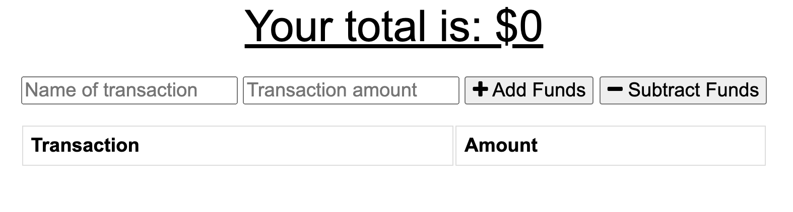

# 19_PWA


## Description

Add functionality to our existing Budget Tracker application to allow for offline access and functionality.

The user will be able to add expenses and deposits to their budget with or without a connection. When entering transactions offline, they should populate the total when brought back online.

Offline Functionality:

- Enter deposits offline

- Enter expenses offline

When brought back online:

- Offline entries should be added to tracker.

## Table of Contents

- [Deployment](#deployment)
- [User Story](#user-story)
- [Mock-Up](#mock-up)
- [Acceptance Criteria](#acceptance-criteria)
- [License](#license)
- [Contribute](#contribute)

## Deployment

The app can be found at this link:
https://radiant-shelf-24566.herokuapp.com/

## User Story

```md
AS AN avid traveller
I WANT to be able to track my withdrawals and deposits with or without a data/internet connection
SO THAT my account balance is accurate when I am traveling
```

## Mock-Up

The following image shows a screenshot of the deployed application.



## Acceptance Criteria

```md
GIVEN a user is on Budget App without an internet connection
WHEN the user inputs a withdrawal or deposit
THEN that will be shown on the page, and added to their transaction history when their connection is back online.
```

